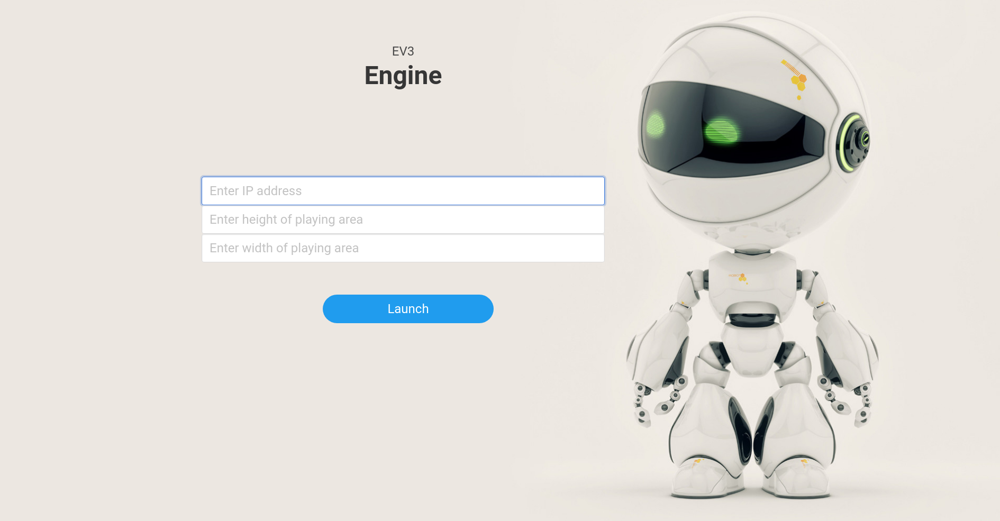
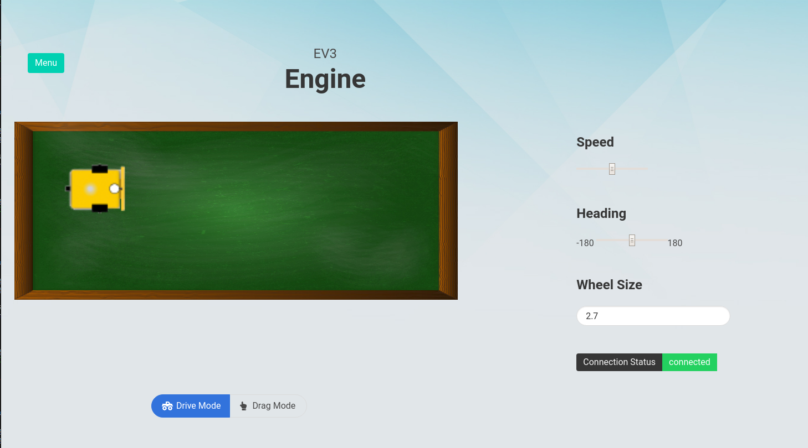

# EV3-Electron
An app developed using electron.js to remotely control a Lego Mindstorms robot that will navigate an area given its dimensions. 

## How to Use
1) Flash EV3Dev onto the Lego Mindstorms
2) Connect Mindstorms to WiFi and run robo-server.py on the Mindstorms robot
3) Run EV3-Electron on local machine and enter the ip address shown on Mindstorms display on the Main Page
4) Enter the play width and height of the table.

## Main Page
Run the robo-server.py on the EV3

## Navigation Mode

